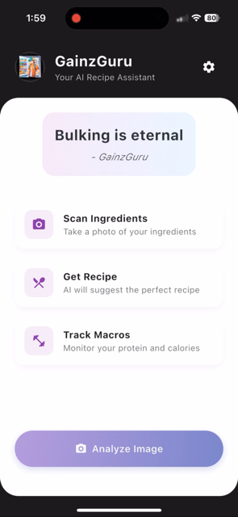
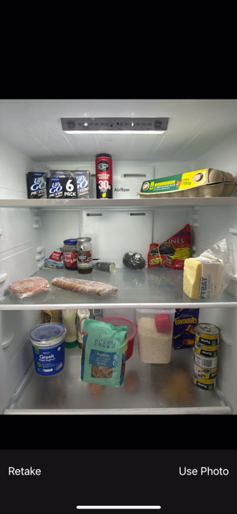
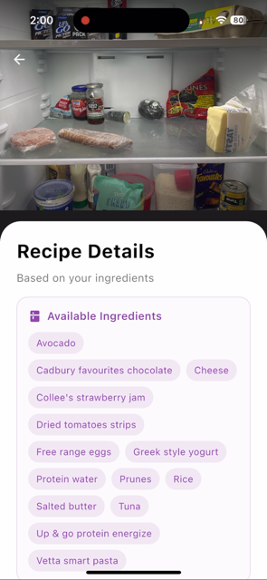
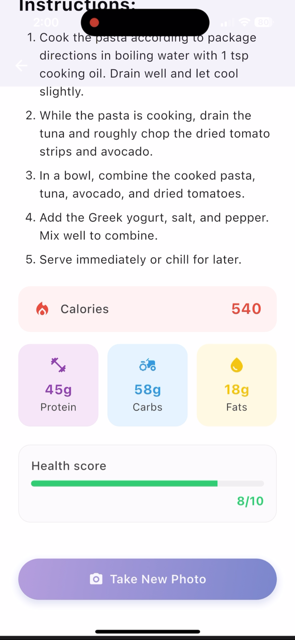

# GainzGuru

GainzGuru is a Flutter app that uses AI to turn photos of available ingredients into recipe suggestions, estimated nutrition values, and (optionally) generated meal images. 

## Features

- Capture ingredient photos with the device camera
- Generate structured recipes from detected ingredients
- Estimate calories, protein, carbs, fats, and a health score
- Optional recipe image generation via OpenAI
- Optional multi-image flow for combining ingredient sources

## Tech Stack

- Flutter (Dart)
- Provider (state management)
- `http` (API requests)
- `image_picker` (camera input)
- `flutter_markdown` (recipe rendering)

## Setup

### Prerequisites

- Flutter SDK (3.x)
- A Gemini API key for recipe/analysis features
- (Optional) An OpenAI API key for generated recipe images

### Install Dependencies

```bash
flutter pub get
```

### Run

Run with `--dart-define` values for API keys:

```bash
flutter run --dart-define=GOOGLE_GEMINI_KEY=your_gemini_key
```

With optional OpenAI image generation:

```bash
flutter run --dart-define=GOOGLE_GEMINI_KEY=your_gemini_key --dart-define=OPENAI_KEY=your_openai_key
```

## App Preview

<table>
  <tr>
    <td align="center">
      <br/>
      <sub>Home</sub>
    </td>
    <td align="center">
      <br/>
      <sub>Scan</sub>
    </td>
    <td align="center">
      <br/>
      <sub>Ingredients</sub>
    </td>
    <td align="center">
      <br/>
      <sub>Recipe</sub>
    </td>
  </tr>
</table>

## Important Security Notes

- This repo has been cleaned to remove embedded credential files and local secret artifacts.
- Before publishing, rotate any credentials that were previously stored in the project (for example old AWS keys and service account/private key material).
- Never commit secrets to source control. Use runtime `--dart-define` values or your secure CI/CD secret store.

## Current Limitations

- API-dependent features require valid external service keys.
- The app currently keeps most UI and business logic in a single `main.dart` file; splitting into feature modules would improve maintainability.
